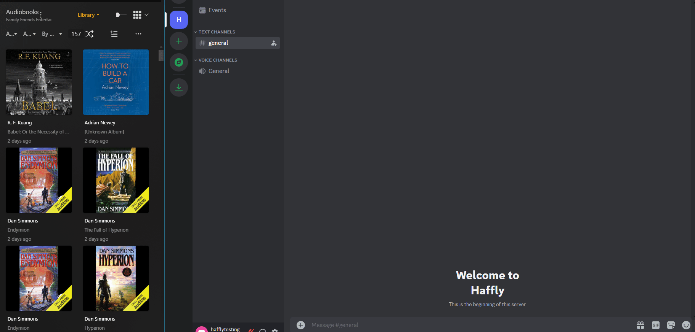

# ✨🤖AudioBook Bay Discord Bot🤖✨

*Disclaimer. This was a personal project to learn DiscordJS and TypeScript. Go easy on me. 

## Overview

This discord bot serves a very niche function: to interactively scrape audiobooks from AudioBook Bay from within discord. 



To utilize this bot you need:
1. To serve audiobooks via Plex (entirely optional)
2. Use Qbitorrent to handle your downloads (I specifically use rdt-client with Debrid)
3. Use Discord

## 🏁 Install

1. Create a Discord Bot
   - Go to https://discord.com/developers/applications
   - Create a new application (you can name it whatever, but AudiobookRequester is nice.) Feel free to use this icon: 
   - Go to OAuth2 > URL Generator page, select bot under Scopes. Then, at minimum, select Embed Links, Use Slash Commands, and Send Messages under Bot Permissions.
   - Click Copy to get the URL and go to that URL.
   - Under Add to Server select your server.
   - Authorize the permissions.
   - Go back to the Discord Developer Portal and go to the Bot page and click Add Bot
   - Turn on Message Content Intent under the heading `Privileged Gateway Intents`.
   - Save the changes.
   - Then copy the Token. You will need to provide this token in your .env file.

2. Create a directory of your choice (e.g. ./abb-discord-bot) to hold the docker-compose.yml and .env files:

```shell
mkdir ./abb-discord-bot
cd ./abb-discord-bot 
```

  3. Download docker-compose.yml and example.env with the following commands:

```
wget https://github.com/jamcalli/ABB-Discord-Bot/releases/download/Release/docker-compose.yml
wget -O .env https://github.com/jamcalli/ABB-Discord-Bot/releases/download/Release/example.env
```
  4. Populate the .env file with your parameters:

Set the following environment variables:

- `DISCORD_TOKEN`: The token from above, when creating your discord bot.
- `DISCORD_CLIENT_ID`: Go to [Discord Developer Applications](https://discord.com/developers/applications) to find your bot application's ID.
- `DISCORD_GUILD_ID`: The [ID of the guild](https://en.wikipedia.org/wiki/Template:Discord_channel#:~:text=To%20get%20the%20channel%2Fserver,to%20get%20the%20guild%20ID.) where your bot will live.
- `QBITTORRENT_HOST`: qBittorrent host address (e.g., http://localhost:6500). Ensure that qbittorent moves the files to the specified Audiobook library for Plex.
- `QBITTORRENT_USERNAME`: qBittorrent username
- `QBITTORRENT_PASSWORD`: qBittorrent password
- `USE_PLEX`: TRUE or FALSE (If not true, then you can leave the other plex variables blank)
- `PLEX_HOST`: Plex server address (e.g., http://localhost:32400)
- `PLEX_TOKEN`: This is your X-Plex-Token. Find out how to get yours [here](https://support.plex.tv/articles/204059436-finding-an-authentication-token-x-plex-token/).
- `PLEX_LIBRARY_NUM`: This is the library section number. It can be found by going to the following URL: `http://[PMS_IP_Address]:32400/library/sections?X-Plex-Token=YourTokenGoesHere`. Replace `YourTokenGoesHere` with your token from above. Note the `key="number"` of your audiobook library. That number goes here.

Your `.env` file should look something like this:

```env
DISCORD_TOKEN=YOUR_DISCORD_TOKEN
DISCORD_CLIENT_ID=YOUR_DISCORD_CLIENT_ID
DISCORD_GUILD_ID=YOUR_DISCORD_GUILD_ID
QBITTORRENT_HOST=YOUR_QBITTORRENT_HOST
QBITTORRENT_USERNAME=YOUR_QBITTORRENT_USERNAME
QBITTORRENT_PASSWORD=YOUR_QBITTORRENT_PASSWORD
USE_PLEX=TRUE
PLEX_HOST=YOUR_PLEX_HOST
PLEX_TOKEN=YOUR_PLEX_TOKEN
PLEX_LIBRARY_NUM=YOUR_PLEX_LIBRARY_NUM
```
5. `docker compose pull && docker compose up -d`

If all was successful, your logs should look something like this:


6. Lastly, use the command /scrape. The AudioBook Bay search query is very janky, so provide at least something to the title filter to narrow down your search results.

## 🙏 Acknowledgements

This project was made possible thanks to the following repositories:

- [AudioBookBay Scraper](https://github.com/licavalentin/audiobookbay): This repository provided the basic functions that this bot relies upon.

Please visit these repositories and give them a star if you found them helpful.